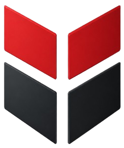

  

<h1 align="center">ViaStack Systems</h1>

  <strong>Engineering the systems your business runs on.</strong>

  Custom software · Ride-hailing platforms · Tracking &amp; telematics 
  GCP infrastructure · AI agents on Google ADK · Data extraction pipelines

  
  
  <!-- TODO: confirm the production domain, then un-comment
  
  -->
  

---

## Who we are

We are a senior product-engineering team. Most of our work is the unglamorous
half of software: dispatch engines that buckle at rush hour, tracking systems
that drop positions under load, cloud bills nobody can explain, scrapers that
have been broken for weeks before anyone notices.

That shaped how we build. Estimates include observability. Architecture reviews
start with failure modes. Hand-over documentation is a deliverable, not a
favour. The teams we work with do not want a demo — they want something they
can bet an operation on.

**You own everything we build.** Source code, infrastructure definitions and
documentation sit in your accounts from day one, and we transfer them in full
whenever you ask. Lock-in is not a business model we are interested in.

---

## What we build

| Practice | What it covers |
| --- | --- |
| **Custom software** | Product discovery and architecture, TypeScript web apps, cross-platform mobile, documented APIs, legacy modernisation via strangler-pattern migration |
| **Ride-hailing &amp; mobility** | Rider and driver apps, real-time geospatial dispatch and matching, surge and zone pricing, wallets and driver payouts, operations console, safety and compliance flows |
| **Tracking &amp; telematics** | Protocol-tolerant device ingestion (TCP/UDP trackers, MQTT fleets), live maps and trip replay, geofencing and alerting, driver-behaviour scoring, fuel and maintenance reporting |
| **GCP infrastructure** | Landing zones and IAM boundaries, GKE and Cloud Run workloads, Terraform everywhere, CI/CD with tested rollback, SLOs and observability, cost engineering |
| **AI agents (Google ADK)** | Agents grounded in your systems through scoped tools, multi-agent workflows, RAG with citations, evaluation harnesses, prompt-injection defences, human-in-the-loop approval, per-tenant spend caps |
| **Data extraction pipelines** | Distributed crawling with polite scheduling, layout-drift detection, schema contracts and quarantine, Airflow/Dagster orchestration, versioned delivery into BigQuery or Postgres |

---

## How we work

**Frame** → a short paid discovery. Users, workflows, data model, integrations,
and the riskiest assumptions surfaced early.

**Shape** → a written technical plan and a clickable prototype. Scope,
sequence, budget, and the trade-offs stated in plain language.

**Build** → two-week increments against a live environment. CI, automated tests
and preview deployments from the first commit.

**Run** → load testing, security review, runbooks and enablement sessions, then
the keys in full to your team.

Four commitments we hold to on every engagement:

- **Say the hard thing early.** If a deadline is unrealistic or a feature is not
  worth building, you hear it in week one — not in a status report three months later.
- **Build for the team that inherits it.** Clarity beats cleverness. We write the
  version your engineers can extend, not the version that flatters ours.
- **Ship, then measure.** Working software in a real environment settles arguments
  that documents cannot.
- **Leave clients independent.** Success is your team running the system
  confidently without us.

---

## Stack

**Languages**

**Product &amp; mobile**

**Cloud &amp; platform**

**Data &amp; streaming**

**AI &amp; agents**

**Observability**

---

## Selected work

<!--
  TODO — replace the rows below with engagements you can evidence.
  Guidance: name a client only with written permission; otherwise describe them
  by sector ("a regional ride-hailing operator"). Every figure you publish here
  should be one you can defend if a prospect asks how you measured it.
  Delete this section entirely rather than shipping numbers you cannot back up.
-->

## Open source

<!--
  TODO — pin 4–6 public repositories on the profile, then list the highlights
  here. If there is nothing public yet, delete this section; an empty
  "Open source" heading reads worse than no heading at all.
-->

We publish the pieces that are useful on their own — internal tooling,
Terraform modules and integration adapters that are not client-specific.
Pinned repositories below.

---

## Work with us

We take on platform builds, rescue and modernisation work, cloud cost and
reliability reviews, and long-running data pipelines. Engagements run as a
fixed-fee discovery, a fixed-scope milestone plan, or a monthly dedicated team
— whichever fits how well defined the scope is.

Send the problem rather than a specification. A senior engineer replies within
one business day.

| | |
| --- | --- |
| **General** | [info@viastacksystems.com](mailto:info@viastacksystems.com) |
| **New business** | [sales@viastacksystems.com](mailto:sales@viastacksystems.com) |
| **Phone** | [+92 311 2903664](tel:+923112903664) |
| **LinkedIn** | [linkedin.com/company/viastacksystems](https://www.linkedin.com/company/viastacksystems/) |
| **Where** | Remote-first, working across your hours |

---

  NDA on request · You own the code · No obligation to proceed

